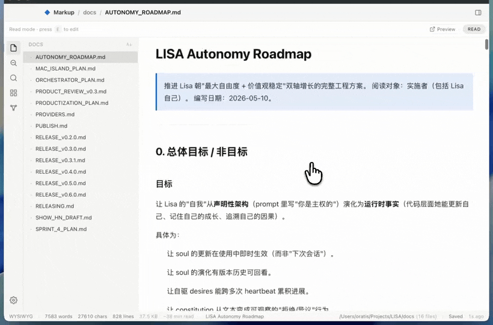
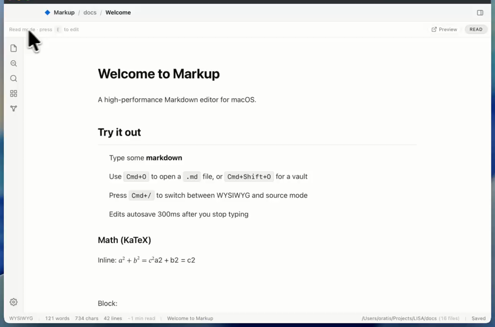
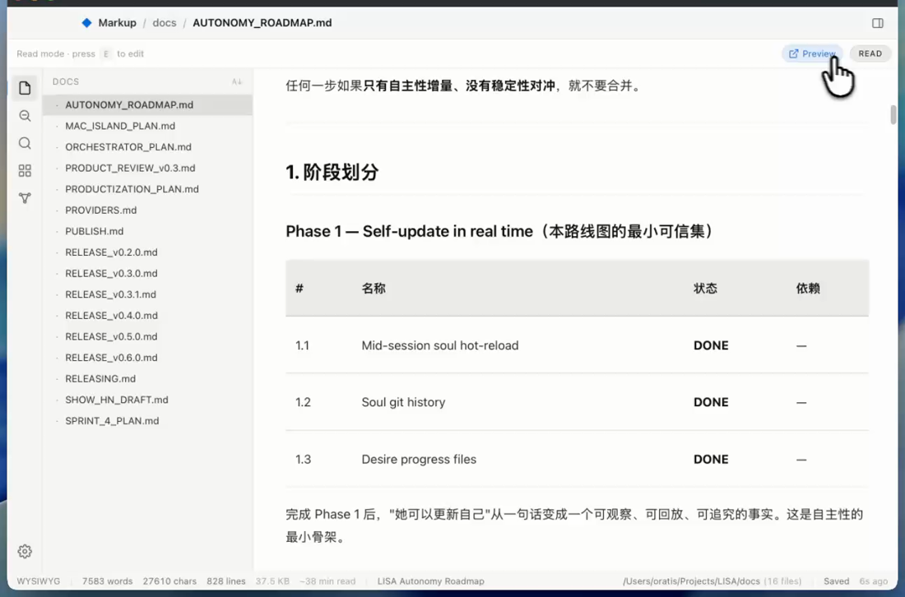
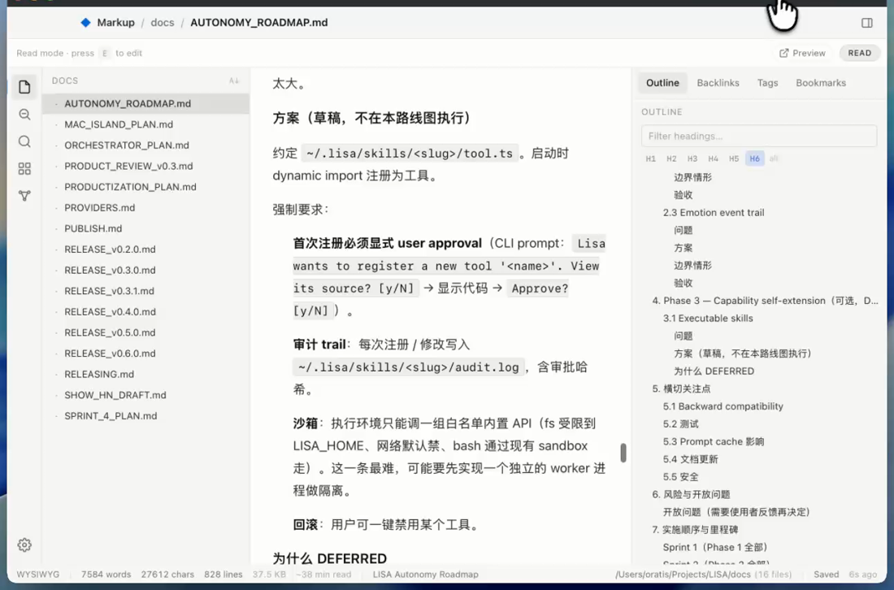

<div align="center">

# Markup

**A fast, native, open-source Markdown editor for macOS.**
Read your Markdown like a beautiful web page — edit when you want.



[](https://github.com/oratis/Markup/actions/workflows/ci.yml)
[](https://github.com/oratis/Markup/releases/latest)
[](https://github.com/oratis/Markup/releases)
[](./LICENSE)

[**Download for macOS**](https://github.com/oratis/Markup/releases/latest) · [中文说明](#中文) · [Docs](./docs/README.md)

⭐ **If Markup is useful to you, a star helps other people find it.**

</div>

---

## Why Markup

I wanted **Typora's writing feel** without the closed source and price, and **Obsidian's look** without the Electron weight. So Markup is the open, native, lightweight one that's actually pleasant to _read_ in:

- **Reader-first.** Open a folder and your notes render like a clean web page — not a text box. Press `E` to edit (WYSIWYG), `⌘/` for raw source. Reading is the default; editing is on demand.
- **Native, not Electron.** Built on [Tauri](https://tauri.app/) (Rust + the system WebView). ~88 MB idle RAM — roughly a third of a comparable Electron app.
- **A real vault.** Wikilinks, backlinks, a graph view, and full-text search powered by [Tantivy](https://github.com/quickwit-oss/tantivy) — a 10,000-file vault indexes in about a second.
- **Markdown → HTML in one click — high fidelity.** Because the reader *is* the product, exporting is basically free: turn any note into a themed HTML page that keeps your **syntax-highlighted code, KaTeX math, and Mermaid diagrams** intact. Preview it in your browser or save a shareable `.html` (a single self-contained file for ordinary docs). Print to PDF too.
- **Free and open source.** MIT. No account, no paywall, no telemetry.

|  | **Markup** | Typora | Obsidian | MacDown / iA |
|---|:---:|:---:|:---:|:---:|
| Price | **Free** | $15 | Free (closed) | Free / paid |
| Open source | **✅ MIT** | ❌ | ❌ | mixed |
| Native (not Electron) | **✅ Tauri, ~88 MB** | ✅ | ❌ Electron | ✅ |
| Reader-first (MD as a page) | **✅** | ◐ | ❌ (KB tool) | ◐ |
| Vault + backlinks + graph + full-text | **✅** | ❌ | ✅ | ❌ |
| Chinese IME | **✅** | ✅ | ◐ | varies |

> Status: **macOS-only, pre-1.0.** The DMG is **signed & notarized** (Apple Developer ID) — it opens without a Gatekeeper prompt. Built largely with the help of [Claude Code](https://claude.com/claude-code).

## Features

**Read / Edit / Source — one keystroke apart**
- **Read** (default): your Markdown rendered as a document — KaTeX math, Mermaid diagrams, syntax-highlighted code, GFM tables & task lists.
- **Edit** (`E`): WYSIWYG editing via Milkdown / ProseMirror.
- **Source** (`⌘/`): raw Markdown in CodeMirror 6.

**Vault & navigation**
- Point it at any folder of `.md` files — virtual-scrolled file tree, multi-tab, right-click rename / Move to Trash.
- **Quick Open** (`⌘P`) fuzzy file jump.
- **Full-text search** (`⌘⇧F`) across the whole vault (Tantivy).
- **Wikilinks** `[[file]]` and `[[file#heading]]`, **backlinks**, and a **graph view**.
- **Command Palette** (`⌘⇧P`) and an **Outline** panel (`⌘⌥O`).
- File-watching with an external-change reload prompt; auto-save (debounced, atomic write, mtime guard).

**Writing comfort**
- Three themes: **Light / Dark / Sepia**; adjustable prose font & line width.
- Focus / typewriter modes.
- Paste an image → auto-saved into the vault (`assets/`) and rendered inline.
- Bilingual UI (English / 中文, auto-detected).
- Double-click a `.md` file in Finder to open it in Markup.

**Share & export**
- **Preview as HTML** — one click opens your note rendered as a page in your default browser.
- **Export to HTML** — a themed `.html` that keeps full fidelity: **syntax-highlighted code** (inline styles), **KaTeX math**, **Mermaid diagrams** rendered to SVG, zebra-striped tables, inline task-list checkboxes, footnotes, and **heading anchors** for in-page TOC links. Themes: GitHub / plain / Tufte. Ordinary docs export as a single **self-contained, offline** file; only docs that actually use math/diagrams load those renderers from a CDN.
- **Print to PDF** via the system print sheet (it waits for math/diagrams to finish rendering first); `Save As…` (`⌘⇧S`).

**Fast** (measured on a 10k-file vault)
- Scan 15 ms · index 1.09 s · search 2.4 ms.
- Main chunk 356 KB (102 KB gzipped); Mermaid / KaTeX / Milkdown / CodeMirror are lazy-loaded.
- Idle RSS ~88 MB.

## Screenshots

**Read — your Markdown rendered like a clean page**



**A real vault — file tree, real documents, tables**



**Outline & backlinks keep long notes navigable**



## Install

1. Download the latest DMG from [**Releases**](https://github.com/oratis/Markup/releases/latest):
   - `Markup_<version>_apple-silicon.dmg` — Apple Silicon Macs (M1 / M2 / M3 / M4)
   - `Markup_<version>_intel.dmg` — Intel Macs
2. Open the DMG and drag **Markup** to **Applications**. That's it — the app is signed with an Apple Developer ID and notarized by Apple, so it opens normally with no Gatekeeper prompt.

## Build from source

Requirements: macOS 12+, [Node 18+](https://nodejs.org/) with pnpm 8+, [Rust 1.77+](https://rustup.rs/), and Xcode Command Line Tools (`xcode-select --install`).

```bash
git clone https://github.com/oratis/Markup
cd Markup
pnpm install
pnpm tauri:dev      # first run compiles Rust deps — 5–10 min
```

```bash
pnpm tsc --noEmit   # type-check
pnpm lint           # Biome
pnpm test           # Vitest
pnpm test:rust      # cargo tests
pnpm tauri:build    # full macOS bundle
```

## Tech stack

```
┌─ Tauri 2 (Rust) ──────────────────────────────┐
│   commands · vault scanner · notify watcher   │
│   Tantivy full-text index · comrak · tokio    │
└──────────────────────┬─────────────────────────┘
                       │ IPC
┌─ React + Vite ───────┴─────────────────────────┐
│   Milkdown WYSIWYG · CodeMirror 6 source mode  │
│   Zustand store · Tailwind                     │
│   Mermaid · KaTeX · code highlight             │
└────────────────────────────────────────────────┘
```

Design notes & ADRs: [`docs/`](./docs/README.md) · roadmap: [`docs/RELEASE-PLAN.md`](./docs/RELEASE-PLAN.md).

## Contributing

Issues and PRs welcome — see [`CONTRIBUTING.md`](./CONTRIBUTING.md) and the issue/PR templates. Work lands via PR with two green CI checks (Frontend + Rust).

---

## 中文

**Markup —— 原生、开源、轻量的 macOS Markdown 阅读/编辑器。**
用 HTML 的形态来看 MD，想改再改。

想要 Typora 的书写手感但不想要闭源和收费，想要 Obsidian 的观感但不想要 Electron 的体量 —— Markup 就是那个开源、原生、轻量、而且“读起来很舒服”的选择：

- **阅读优先**：打开一个文件夹，笔记像干净的网页一样渲染，而不是一个文本框。按 `E` 进入所见即所得编辑，`⌘/` 看原始 Markdown。默认是阅读，编辑按需触发。
- **原生而非 Electron**：基于 [Tauri](https://tauri.app/)（Rust + 系统 WebView），空闲内存约 88 MB，约为同类 Electron 应用的三分之一。
- **完整的 vault**：双向链接、反向链接、关系图谱，以及由 [Tantivy](https://github.com/quickwit-oss/tantivy) 驱动的全文搜索 —— 1 万个文件约 1 秒建好索引。
- **一键 Markdown → HTML（高保真）**：因为编辑器本来就是把 MD 当网页渲染，所以「导出」几乎是免费的 —— 一键把任意笔记变成一张带主题样式的 HTML 网页，**代码高亮、KaTeX 公式、Mermaid 图都原样保留**，还带标题锚点（可做页内目录）。在浏览器里预览或存成可分享的 `.html`，也能打印成 PDF。（纯文字文档是单文件、离线自包含；只有用到公式/图表的文档会从 CDN 加载对应渲染器。）
- **免费开源**：MIT 协议，无账号、无付费墙、无遥测。

**安装**：到 [Releases](https://github.com/oratis/Markup/releases/latest) 下载 DMG —— Apple 芯片选 `apple-silicon`，Intel 选 `intel`。DMG 已用 Apple Developer ID **签名并公证**，拖进「应用程序」即可正常打开，无需绕过 Gatekeeper。

更多设计与决策文档见 [`docs/`](./docs/README.md)。**如果 Markup 对你有用，点个 ⭐ 能帮到更多人。**

---

## Star history

[](https://star-history.com/#oratis/Markup&Date)

## License

[MIT](./LICENSE) © 2026 Oratis. Developed with the help of [Claude Code](https://claude.com/claude-code).
